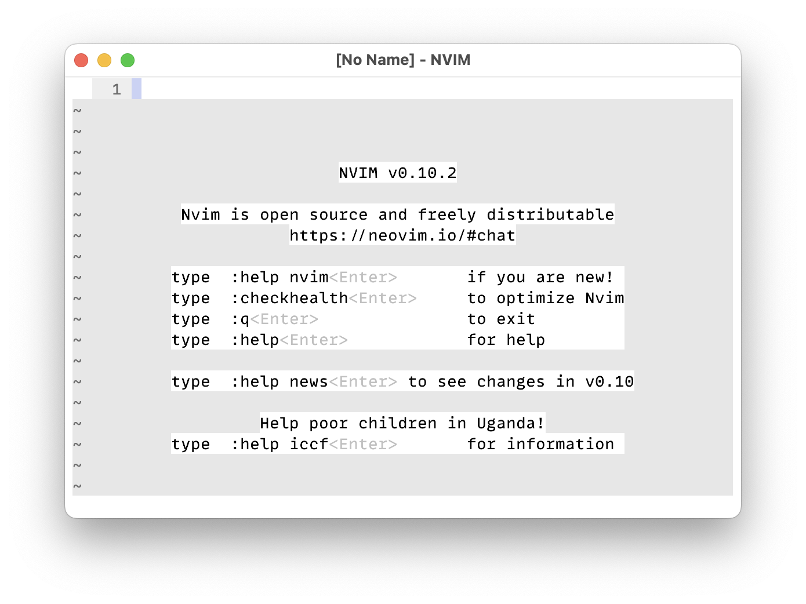

nvim-kitty-bg
=============

This is a neovim plugin that solves one very specific problem:


You have a dark kitty background, but your neovim colorscheme has a bright background.

This plugin syncs your colorscheme background to kitty, and returns it back when you exit neovim:



You're welcome.

Installation
------------

> **Note:** This only works if your kitty is configured with `allow_remote_control`. ([kitty docs](https://sw.kovidgoyal.net/kitty/conf/#opt-kitty.allow_remote_control))

```lua
-- In lazy.vim
{
    "netmute/nvim-kitty-bg",
    opts = {},
},

```
